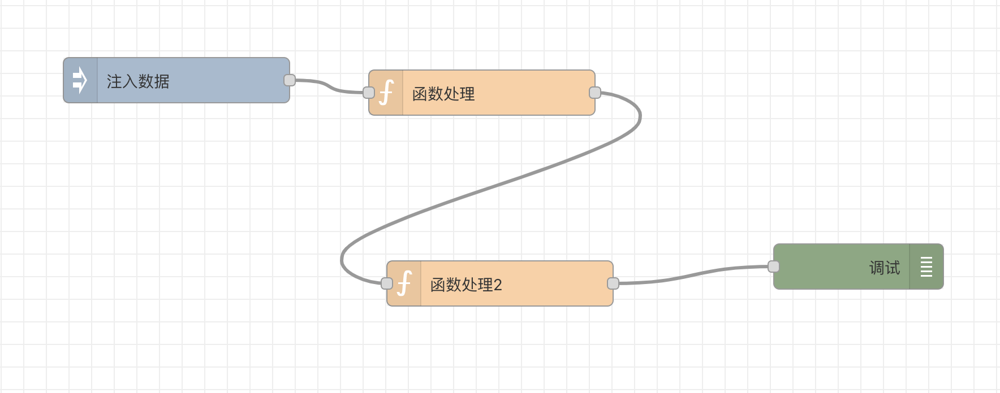

# SF.js

## 简介
实现了一个轻量级的web端流程渲染引擎，可以用来渲染类似工作流、业务流等流程图，流程图最终可以通过序列化保存成一个json结构存储起来，
后续再通过该引擎反序列化json数据到画布上。



**核心能力包括：**
- 支持自定义注册不同类型的节点（输入节点、处理节点、输出节点等），配置节点样式
- 支持在画布上添加节点、移动节点、修改节点配置属性、删除节点等
- 支持节点之间进行拖拽连线
- 支持图纸的序列化和反序列化，数据格式为json，可存储到数据库
- 支持历史管理，可以进行undo、redo操作
- 支持缩放画布
- 支持框选
- 支持复制/粘贴/删除等快捷键操作
- 支持单选、多选节点
- 基于SVG进行节点渲染，放大缩小不失真


**SF.js主要包括由以下几个类构成：**

- GraphView：画布模型，负责画布相关的处理，包括初始化画布、事件绑定、快捷键绑定
- DataModel：数据模型，负责图纸序列化/反序列化，添加、删除节点、添加连线，遍历节点，根据id获取节点信息等， 通过对dataModel操作，实现画布的渲染，一般不直接操作GraphView
- SelectionModel：选择模型，负责管理节点选中相关操作，单选、全选、取消选择、获取当前选中节点等
- HistoryManager：历史管理模型，负责存储操作记录，支持undo和redo
- Node：节点模型，设置节点宽高/位置、业务属性、画布上的渲染（draw和redraw）
- Wire：连线模型，负责节点之间的连线在画布上渲染（draw和redraw）

## 安装使用

### 通过html直接引入

可下载lib目录下的文件sf.js和sf.css，在html中直接引入
```html
<html>
    <head>
      <!--   引入sf.js和sf.css   -->
      <link rel="stylesheet" href="./lib/sf.css"> 
      <script src="./lib/sf.js"></script>
    </head>

    <body>
    ...
    </body>

</html>
```

### 通过npm安装

通过npm install安装simple-flow-web
```shell
npm install simple-flow-web
```

在项目中通过import引入
```javascript
import SF from 'simple-flow-web'
import 'simple-flow-web/lib/sf.css'
```


## 用法示例
### 实例化
由于HistoryManager和GraphView都需要用到数据模型DataModel，所以先实例化DataMode
```javascript
let dataModel = new SF.DataModel()
let historyManager = new SF.HistoryManager(dataModel)
let graphView = new SF.GraphView(dataModel, {
    graphView: {
        width:6000,
        height:6000,
        scale:{
            max:3
        },
        editable:true, //设为true则可以进行各种编辑操作（添加/删除/修改节点等）; 设为false一般用于运行态，只允许查看
    }
})
```
实例化GraphView时可以传入一些参数，来指定画布的默认样式，如宽高，最大/最小缩放比例等

### 注册节点

节点就是在画布上显示的一个一个的功能节点，不同类型的节点有不同的样式（背景色、文本颜色、icon、输入节点数量，输出节点数量，默认宽高）

语法：第一个参数为节点类型，第二个参数为配置项
```javascript
graphView.registerNode(nodeType,options)
```

如，我们注册3种节点，输入节点、函数处理节点和调试节点

```javascript
graphView.registerNode('inject',{
            class: 'node-inject',
            align:'left',
            category: 'common',
            bgColor: '#a6bbcf',
            color:'#fff',
            defaults:{},
            icon: require('../icons/node/inject.svg'),
            inputs:0,
            outputs:1,
            width:150,
            height: 40
        })
        
graphView.registerNode('function',{
    align:'left',
    category: 'common',
    bgColor: 'rgb(253, 208, 162)',
    color:'#fff',
    defaults:{},
    icon: require('../icons/node/function.svg'),
    inputs:1,
    outputs:1,
    width:150,
    height: 40
})
graphView.registerNode('debug',{
    align:'right',
    category: 'common',
    bgColor: '#87a980',
    color:'#fff',
    defaults:{},
    icon: require('../icons/node/debug.svg'),
    inputs:1,
    outputs:0,
    width:150,
    height: 40
})
```

### 在画布上添加节点和连线

可通过new SF.Node(options) 来实例化一个节点，options的选项有

- type：节点类型，即在上面graphView.registerNode(nodeType)时的type，指明要创建的节点是什么类型
- id：可选，如未设置，SF会自动创建一个id
- p：可选，节点的系统属性，包括宽高位置和名称，
  - width：节点宽度
  - height：节点高度
  - position：位置，形如，{x:100,y:100}
  - displayName：节点名称，显示在节点之上
- a：可选，Object，节点的业务属性，可用来存储节点的业务信息，如节点可能需要对外暴露一些需要绑定的属性，用户输入属性值之后，存储在这里

  - 比如该节点是个脚本节点，那需要存储节点的具体脚本， 那么我们可以把这个脚本信息，存在a属性中，通过node.a("script","function(){}")
- wires：可选，连线信息，存储该节点后面链接那些节点，数组如，[["nodeId1",'nodeId2']]，代表第一个output端口链接nodeId1和nodeId2两个节点

```javascript
let node = new SF.Node({
            type: 'inject',
        })

node.setPosition(100,100) //实例化节点时可先不知道位置，然后通过方法调整位置
node.setDisplayName("定时触发流程")
dataModel.add(node) //如果不添加到dataModel，那么不会在画布上显示
```
创建连线通过new SF.Wires({source: sourceNode, target: targetNode })来实现

```javascript
let node1 = new SF.Node({
    type: 'inject',
})
node1.setPosition(100,100)
node1.setDisplayName("定时触发流程")


let node2 = new SF.Node({
    type: 'function',
})
node2.setPosition(300,200)
node2.setDisplayName("函数组件")

let wire = new SF.Wires({
    source: node1,
    target: node2
})
dataModel.add(node1)
dataModel.add(node2)
dataModel.add(wire)
```

### 序列化图纸为json
绘制完图纸后，希望将图纸序列化为JSON，后续可以进行存储，如调用接口存储到数据库
```javascript
let json = dataModel.serialize()
//可调用接口将json存储到数据库
```

### 反序列化图纸到画布上

我们一般真实使用时，是先有图纸的信息，JSON格式，然后通过反序列化，渲染到图纸上
```javascript
//图纸json正常是通过接口请求回来的
let json = {"v":"1.0.0","p":{"width":5000,"height":5000,"gridSize":20,"background":"#fff"},"a":{"init":true},"d":[{"type":"inject","id":"1aa6129ca0eb2042","p":{"displayName":"注入数据","position":{"x":295,"y":106},"width":200,"height":40},"a":{"payload":"","payloadType":"date","repeat":"","crontab":"","once":false,"onceDelay":0.1},"wires":[["49536505a4488892"]]},{"type":"function","id":"49536505a4488892","p":{"displayName":"函数处理","position":{"x":565,"y":117},"width":200,"height":40},"a":{"payload":"","payloadType":"date","repeat":"","crontab":"","once":false,"onceDelay":0.1},"wires":[["a2a0ae774c68190b"]]},{"type":"function","id":"a2a0ae774c68190b","p":{"displayName":"函数处理2","position":{"x":589,"y":217},"width":200,"height":40},"a":{"payload":"","payloadType":"date","repeat":"","crontab":"","once":false,"onceDelay":0.1},"wires":[["cbe4c17ebc4b7c03"]]},{"type":"debug","id":"cbe4c17ebc4b7c03","p":{"displayName":"调试","position":{"x":911,"y":229},"width":150,"height":40},"a":{"payload":"","payloadType":"date","repeat":"","crontab":"","once":false,"onceDelay":0.1},"wires":[]}]}
dataModel.deserialize(json)
```

### 将画布挂载到页面上
在画布挂载到dom之前，页面上是不显示的，可通过addToDom将画布挂载到页面上
```javascript
graphView.addToDom(document.getElementById('simple-flow-wrapper'))
```

